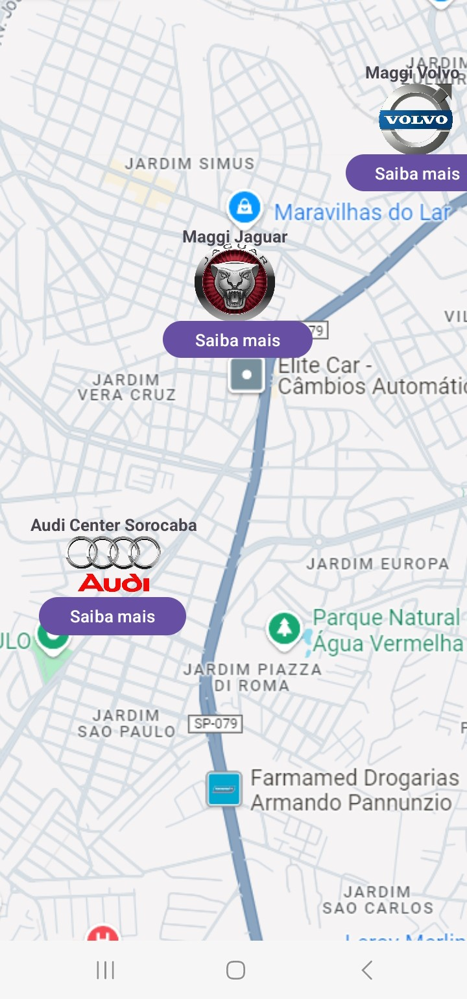
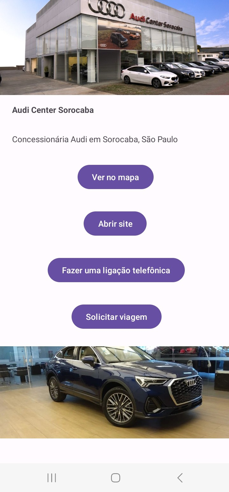

# Atividade-Dois-01-10

### Atividade Dois (01/10/2024)
### Fiz uma aplicação que simula um mapa de concessionárias automativas em Sorocaba.

### Ao selecionar a concessionária desejada você tem diversas opções que, através de intents implicitas no código, chamam algum aplicativo instalado no dispositivo mobile, sendo que ele precisa ter sido configurado no intent-filter, para responder a solicitação.

